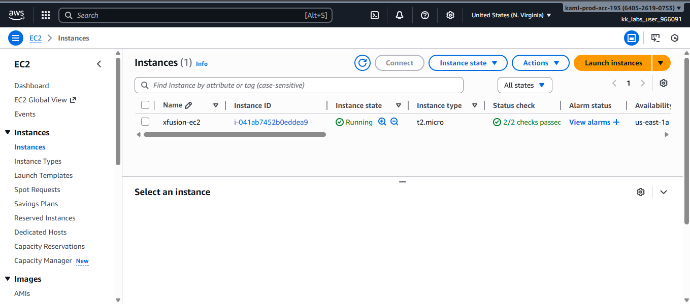
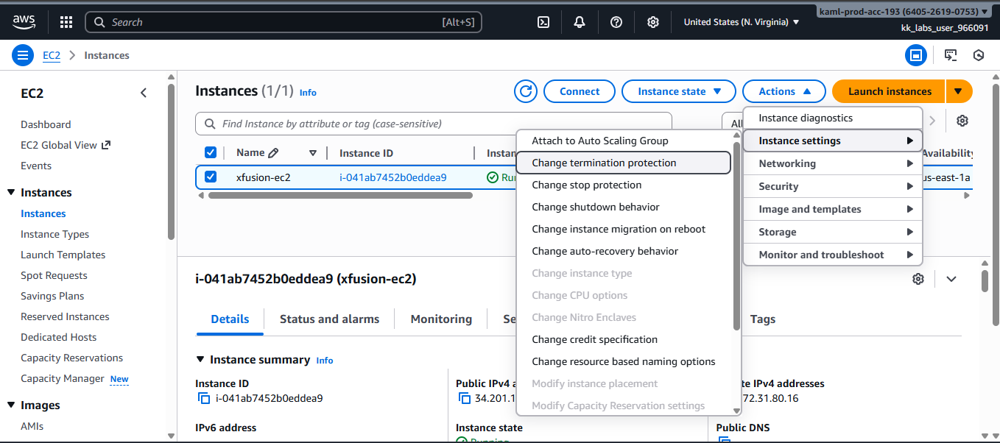
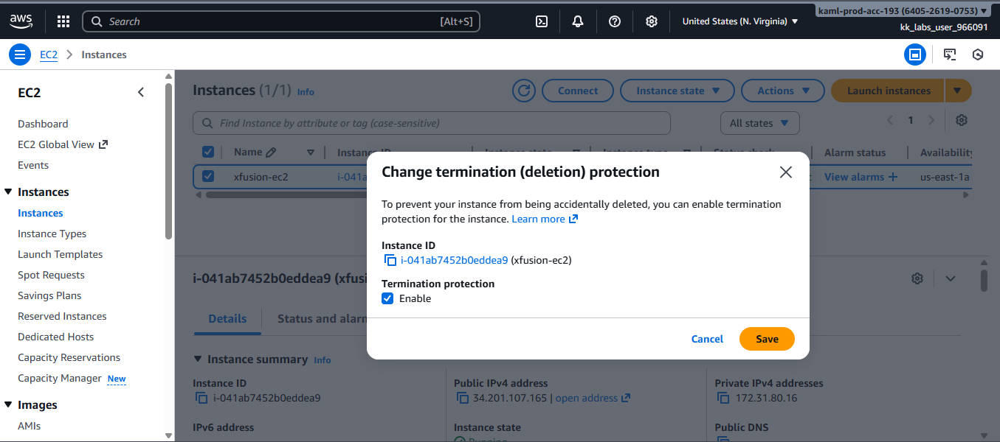

# Enable-EC2-Termination-Protection

This guide demonstrates how to enable **termination protection** for an existing Amazon EC2 instance using the AWS Management Console (GUI).  

## What is Termination Protection?
**Termination protection** is an EC2 safety feature that prevents an instance from being accidentally terminated through the AWS Console, CLI, or API.  
It is especially useful for **production**, **long-running**, or **critical workloads** where accidental deletion could cause downtime or data loss.

## Step 1: Log in to the AWS Management Console

Sign in to the AWS Management Console using your credentials.

## Step 2: Open the EC2 Dashboard

- From the **Services** menu, search for **EC2**
  
- Click on **EC2** to open the EC2 Dashboard
 

## Step 3: Locate the EC2 Instance

- In the left-hand navigation pane, click **Instances**
 
- Locate the instance named **`xfusion-ec2`**

- Select the instance by checking the box next to it
  

## Step 4: Open Termination Protection Settings

- Click on **Actions**
  
- Navigate to **Instance settings**
  
- Select **Change termination protection**
  

## Step 6: Enable Termination Protection

- Choose **Enable**
  
- Click **Save**
  

## Verification
Once enabled, AWS will prevent the instance from being terminated accidentally.  
Any attempt to terminate the instance will result in an error unless termination protection is disabled.

## Conclusion
- Enabling termination protection is a simple but effective safeguard for critical EC2 instances.
- It helps prevent accidental termination during migrations or production operations.
- This setting is a recommended best practice for important workloads in AWS.

